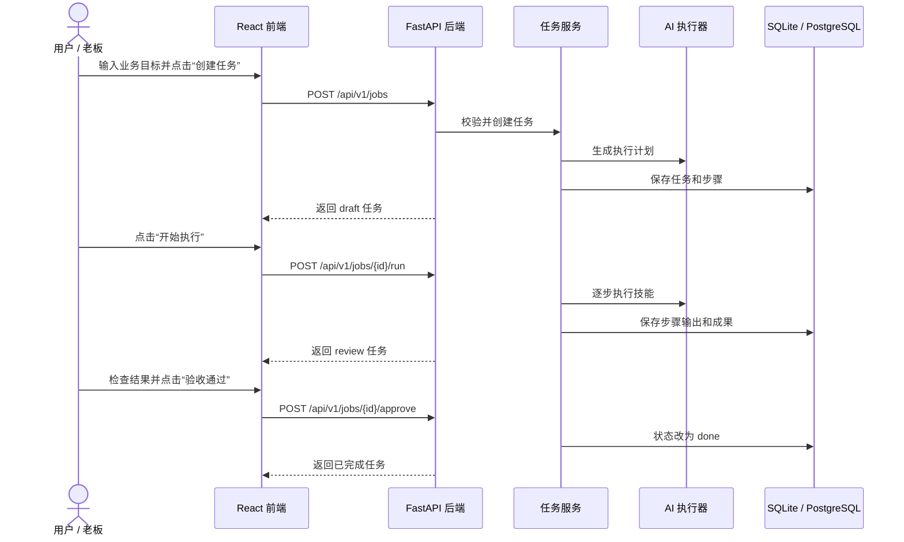
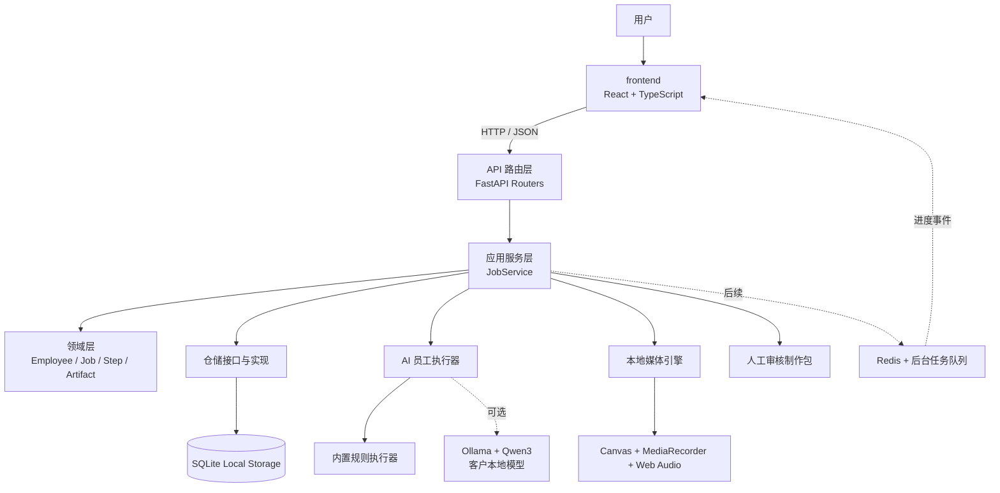
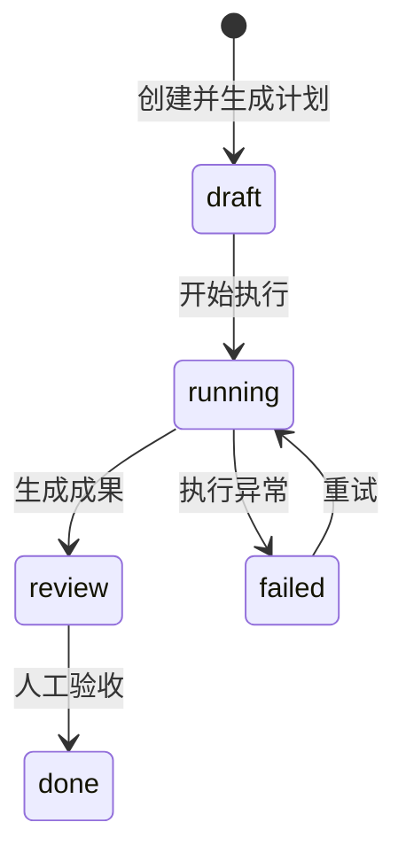

# 超级 AI 员工：系统架构

这份文档描述 Superstaff 独立产品的全栈架构。学习与面试讲解属于开发过程的伴随材料，见 `LEARNING_GUIDE.md`，不会改变产品的信息架构和界面。

## 1. 产品核心

超级 AI 员工不是一个“视频生成器”，也不是一个只有聊天框的模型壳。它的核心是：

> 用户只描述业务目标，系统选择或调用一个 AI 员工，完成计划、执行、交付和验收的闭环。

一名 AI 员工由五部分构成：

- **角色**：它是谁，例如内容运营、销售助理、客户成功。
- **目标**：它长期负责什么业务结果。
- **技能**：写文案、查资料、做视频、整理线索等可调用能力。
- **工作流**：面对一个目标时如何拆步骤、执行和复查。
- **权限与记忆**：可以访问哪些工具和数据，以及需要记住什么上下文。

视频生成只是“内容运营员工”的一个技能。即使暂时关闭视频模块，员工仍应能接任务、产出内容、进入人工验收并保存成果。

## 2. 一次任务如何穿过整个系统



第一版执行是同步的，便于学习和验证。第二版会把耗时任务放入后台队列，并通过 SSE 推送实时进度。

## 3. 总体分层



### 前端负责什么

`frontend/` 是用户直接看到和操作的部分：

- React 把页面拆成可以复用的组件。
- TypeScript 约束数据类型，减少接口字段写错。
- 页面状态记录加载中、失败、选中的员工和任务。
- API 客户端把用户操作转换成 HTTP 请求。
- CSS 负责布局、颜色、响应式适配和交互反馈。

前端不保存模型密钥或平台密码，也不直接决定任务的业务状态。

### 后端负责什么

`backend/` 是服务器上的业务和数据部分：

- API 路由接收请求、验证输入、返回 JSON。
- 应用服务编排完整用例，例如创建、执行和验收任务。
- 领域对象表达业务概念和状态规则。
- 仓储层负责读写数据库，让业务层不依赖具体数据库。
- 执行器负责调用规则、本地模型和技能，不把模型运行时代码散落在业务逻辑里。

### 数据层负责什么

- 当前产品使用 SQLite：它是客户本机上的单文件数据库，零配置且容易备份。
- 视频文件由浏览器下载，数据库只保存创作参数、脚本、分镜和任务状态。
- 企业多用户版再评估 PostgreSQL、对象存储、Redis 和后台任务队列。

### AI 层负责什么

AI 层不是整个系统，只是后端可以调用的一种能力：

- 根据目标生成结构化计划。
- 按步骤选择技能并生成结果。
- 记录执行器类型、本地模型、耗时和生成来源。
- 对输出做格式校验、质量检查和失败重试。
- 在发送消息、发布内容或产生费用前等待人工批准。

## 4. 仓库结构

```text
超级AI员工/
├── frontend/               # React + TypeScript 前端
│   ├── src/api/            # 对后端发 HTTP 请求
│   ├── src/components/     # 可复用 UI 组件
│   ├── src/pages/          # 页面级组件
│   ├── src/types/          # 前后端数据契约
│   └── src/styles/         # 页面样式
├── backend/                # 正式 FastAPI 后端
│   ├── app/api/            # HTTP 路由
│   ├── app/domain/         # 业务实体与规则
│   ├── app/services/       # 用例编排
│   ├── app/repositories/   # 数据访问抽象
│   ├── app/infrastructure/ # SQLite、配置等基础设施
│   ├── app/integrations/   # Ollama 等本地能力适配器
│   ├── app/executors/      # 规则与本地模型执行器
│   └── tests/              # API 与业务测试
├── docker-compose.yml      # 基础本地版
├── docker-compose.local-ai.yml # Ollama 本地模型扩展
└── docs/                   # 架构、商业化、交付与学习记录
```

## 5. 第一批领域对象

| 对象 | 含义 | 关键字段 |
| --- | --- | --- |
| `Employee` | 一名可被派活的 AI 员工 | 角色、使命、技能、状态 |
| `Job` | 用户下达的一次业务目标 | 标题、目标、员工、状态 |
| `JobStep` | 员工为任务制定的一个步骤 | 顺序、说明、状态、输出 |
| `Artifact` | 可保存和复用的交付成果 | 类型、标题、正文、来源任务 |
| `Workflow` | 可以反复使用的自动化模板 | 名称、步骤定义、运行次数 |
| `WorkflowRun` | 一次真实工作流执行 | 输入、步骤状态、输出、完成时间 |
| `Asset` | 可以搜索、归档和跨模块复用的成果 | 来源、类型、正文、标签、状态 |
| `AssetHandoff` | 一次成果跨模块流转任务 | 成果、目标模块、状态、时间 |
| `TaskCenterItem` | 任务中心统一读模型 | 来源、步骤、进度、成果引用 |
| `ProductionJob` | 视频、剪辑或发布模块的执行任务 | 交接、状态、创作简报、脚本、场景、排期 |
| `ProductionBrief` | 视频项目的品牌与创作约束 | 受众、目标、画幅、风格、节奏、颜色、CTA |
| `ProductionScene` | 视频制作中的一个场景 | 画面、旁白、时长、景别、运动、转场 |
| `SocialAccount` | 内容矩阵中的账号元数据 | 平台、名称、标识、授权状态 |
| `WorkspaceSettings` | 单工作区的产品设置 | 名称、运行模式、人工确认、首次引导 |
| `ProviderConfig` | 本地能力适配状态 | 类别、适配器、模式、说明 |
| `AuditEvent` | 成功写操作的审计记录 | 动作、资源、状态码、时间 |

任务状态机：



状态由后端控制。前端只能请求“开始执行”或“验收”，不能随意把 `draft` 改成 `done`。

## 6. API 契约

首个可用纵向切片包含：

| 方法 | 地址 | 用途 |
| --- | --- | --- |
| `GET` | `/api/v1/health` | 服务健康检查 |
| `GET` | `/api/v1/employees` | 查询可用员工 |
| `POST` | `/api/v1/jobs` | 下达目标并创建任务 |
| `GET` | `/api/v1/jobs` | 查询任务中心 |
| `GET` | `/api/v1/jobs/{id}` | 查询任务、步骤和成果 |
| `POST` | `/api/v1/jobs/{id}/run` | 让员工执行任务 |
| `POST` | `/api/v1/jobs/{id}/approve` | 人工验收成果 |
| `GET/POST` | `/api/v1/workflows` | 查询或创建工作流模板 |
| `DELETE` | `/api/v1/workflows/{id}` | 删除自定义工作流 |
| `POST` | `/api/v1/workflows/{id}/runs` | 运行工作流并保存每步结果 |
| `GET` | `/api/v1/workflow-runs` | 查询全部或指定工作流的运行记录 |
| `GET` | `/api/v1/tasks` | 统一查询 Agent 任务与工作流运行 |
| `GET/PATCH` | `/api/v1/assets/{id}` | 查看或编辑成果资产 |
| `GET` | `/api/v1/assets` | 搜索并筛选全部成果资产 |
| `POST` | `/api/v1/assets/{id}/handoffs` | 创建视频、剪辑或发布流转任务 |
| `GET` | `/api/v1/asset-handoffs` | 查询跨模块流转记录 |
| `GET` | `/api/v1/production-jobs` | 查询视频、剪辑与发布制作任务 |
| `POST` | `/api/v1/production-jobs/{id}/run` | 生成脚本和多场景方案 |
| `PATCH` | `/api/v1/production-jobs/{id}/brief` | 保存创作简报和品牌套件 |
| `PATCH` | `/api/v1/production-jobs/{id}/scenes/{order}` | 编辑指定镜头 |
| `POST` | `/api/v1/production-jobs/{id}/approve` | 人工确认制作方案 |
| `POST` | `/api/v1/production-jobs/{id}/schedule` | 选择账号并保存发布计划 |
| `GET/POST` | `/api/v1/accounts` | 查询或添加内容账号元数据 |
| `GET/PATCH` | `/api/v1/workspace` | 查询或更新工作区设置 |
| `GET` | `/api/v1/admin/providers` | 查询本地能力适配状态 |
| `GET` | `/api/v1/admin/local-model` | 检查 Ollama 和目标模型状态 |
| `GET` | `/api/v1/admin/diagnostics` | 查询版本、运行时、存储和业务计数 |
| `GET` | `/api/v1/admin/audit-events` | 查询成功写操作审计 |
| `GET` | `/api/v1/admin/backups/export` | 下载全量 JSON 数据备份 |

所有接口以 JSON 通信。FastAPI 会自动生成 `/docs` 交互式接口文档。

## 7. 从 Demo 到正式产品的演进

1. **本地纵向闭环**：任务、工作流、成果、视频、审核、SQLite 和规则执行器。
2. **本地模型**：Ollama + Qwen3、结构化分镜输出、状态诊断和模型切换。
3. **后台执行**：任务队列、SSE 进度、超时、重试和取消。
4. **技能平台**：文件、知识库、研究、视频等统一工具协议与权限。
5. **企业产品化**：登录、团队权限、审计、安装器、升级、备份恢复和监控。

每一步都保持系统可运行，并只增加能形成业务闭环的模块。

## 8. 当前明确不做的事

- 不把训练写实视频基础模型作为近期目标。
- 不在前端持有平台密码或模型密钥。
- 不同时接十个平台账号；先把技能接口和授权边界做正确。
- 不为了“架构高级”提前拆微服务。一个结构清楚的单体后端更适合当前阶段。
