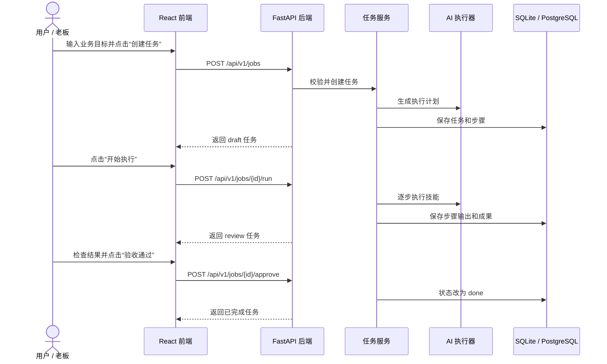
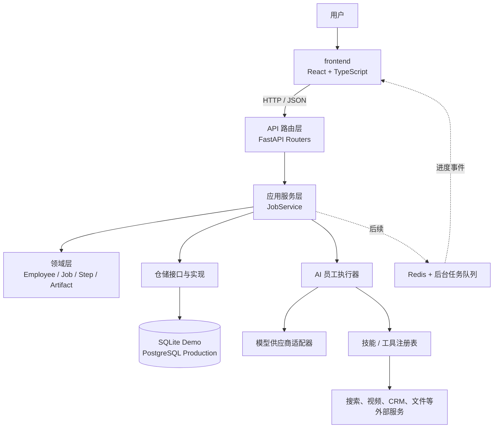
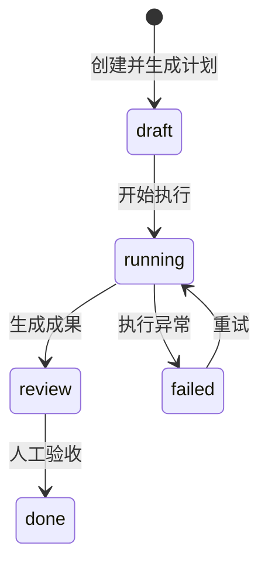

# 超级 AI 员工：系统架构

这份文档只描述如何把参考视频中的超级员工系统真正做出来。学习与面试讲解属于开发过程的伴随材料，见 `LEARNING_GUIDE.md`，不会改变产品的信息架构和界面。

## 1. 产品核心

超级 AI 员工不是一个“视频生成器”，也不是一个只有聊天框的模型壳。它的核心是：

> 用户只描述业务目标，系统选择或调用一个 AI 员工，完成计划、执行、交付和验收的闭环。

一名 AI 员工由五部分构成：

- **角色**：它是谁，例如内容运营、销售助理、客户成功。
- **目标**：它长期负责什么业务结果。
- **技能**：写文案、查资料、做视频、整理线索等可调用能力。
- **工作流**：面对一个目标时如何拆步骤、执行和复查。
- **权限与记忆**：可以访问哪些工具和数据，以及需要记住什么上下文。

视频生成只是“内容运营员工”的一个技能。即使暂时关闭视频模块，员工仍应能接任务、产出内容、进入人工验收并保存成果。

## 2. 一次任务如何穿过整个系统



第一版执行是同步的，便于学习和验证。第二版会把耗时任务放入后台队列，并通过 SSE 推送实时进度。

## 3. 总体分层



### 前端负责什么

`frontend/` 是用户直接看到和操作的部分：

- React 把页面拆成可以复用的组件。
- TypeScript 约束数据类型，减少接口字段写错。
- 页面状态记录加载中、失败、选中的员工和任务。
- API 客户端把用户操作转换成 HTTP 请求。
- CSS 负责布局、颜色、响应式适配和交互反馈。

前端不应保存真正的 API Key，也不应直接决定任务的业务状态。

### 后端负责什么

`backend/` 是服务器上的业务和数据部分：

- API 路由接收请求、验证输入、返回 JSON。
- 应用服务编排完整用例，例如创建、执行和验收任务。
- 领域对象表达业务概念和状态规则。
- 仓储层负责读写数据库，让业务层不依赖具体数据库。
- 执行器负责调用模型和技能，不把供应商代码散落在业务逻辑里。

### 数据层负责什么

- Demo 使用 SQLite：它是一个本地文件，零配置，适合学习和演示。
- 正式部署使用 PostgreSQL：支持并发、多用户、备份和更强查询能力。
- 大文件进入对象存储，不直接塞进数据库。
- Redis 和任务队列用于耗时工作、重试、超时和并发控制。

### AI 层负责什么

AI 层不是整个系统，只是后端可以调用的一种能力：

- 根据目标生成结构化计划。
- 按步骤选择技能并生成结果。
- 记录提示词版本、模型、耗时和成本。
- 对输出做格式校验、质量检查和失败重试。
- 在发送消息、发布内容或产生费用前等待人工批准。

## 4. 仓库结构

```text
超级AI员工/
├── index.html              # 现有 v0.2 静态原型，持续可演示
├── app.js
├── app2.js
├── frontend/               # 正式 React + TypeScript 前端
│   ├── src/api/            # 对后端发 HTTP 请求
│   ├── src/components/     # 可复用 UI 组件
│   ├── src/pages/          # 页面级组件
│   ├── src/types/          # 前后端数据契约
│   └── src/styles/         # 页面样式
├── backend/                # 正式 FastAPI 后端
│   ├── app/api/            # HTTP 路由
│   ├── app/domain/         # 业务实体与规则
│   ├── app/services/       # 用例编排
│   ├── app/repositories/   # 数据访问抽象
│   ├── app/infrastructure/ # SQLite、配置等基础设施
│   ├── app/executors/      # AI 员工执行器
│   └── tests/              # API 与业务测试
└── docs/                   # 架构、学习与决策记录
```

静态原型暂时保留，因为它能立即展示已有能力。新前后端逐个替换它的页面，而不是先推倒再等待数月。

## 5. 第一批领域对象

| 对象 | 含义 | 关键字段 |
| --- | --- | --- |
| `Employee` | 一名可被派活的 AI 员工 | 角色、使命、技能、状态 |
| `Job` | 用户下达的一次业务目标 | 标题、目标、员工、状态 |
| `JobStep` | 员工为任务制定的一个步骤 | 顺序、说明、状态、输出 |
| `Artifact` | 可保存和复用的交付成果 | 类型、标题、正文、来源任务 |
| `Workflow` | 可以反复使用的自动化模板 | 名称、步骤定义、运行次数 |
| `WorkflowRun` | 一次真实工作流执行 | 输入、步骤状态、输出、完成时间 |

任务状态机：



状态由后端控制。前端只能请求“开始执行”或“验收”，不能随意把 `draft` 改成 `done`。

## 6. API 契约

首个可用纵向切片包含：

| 方法 | 地址 | 用途 |
| --- | --- | --- |
| `GET` | `/api/v1/health` | 服务健康检查 |
| `GET` | `/api/v1/employees` | 查询可用员工 |
| `POST` | `/api/v1/jobs` | 下达目标并创建任务 |
| `GET` | `/api/v1/jobs` | 查询任务中心 |
| `GET` | `/api/v1/jobs/{id}` | 查询任务、步骤和成果 |
| `POST` | `/api/v1/jobs/{id}/run` | 让员工执行任务 |
| `POST` | `/api/v1/jobs/{id}/approve` | 人工验收成果 |
| `GET/POST` | `/api/v1/workflows` | 查询或创建工作流模板 |
| `DELETE` | `/api/v1/workflows/{id}` | 删除自定义工作流 |
| `POST` | `/api/v1/workflows/{id}/runs` | 运行工作流并保存每步结果 |
| `GET` | `/api/v1/workflow-runs` | 查询全部或指定工作流的运行记录 |

所有接口以 JSON 通信。FastAPI 会自动生成 `/docs` 交互式接口文档。

## 7. 从 Demo 到正式产品的演进

1. **纵向闭环**：一名内容运营员工、一个任务中心、SQLite、演示执行器。
2. **接入真实模型**：统一模型适配器、服务端密钥、流式输出、成本记录。
3. **后台执行**：Redis、任务队列、SSE 进度、超时、重试和取消。
4. **技能平台**：搜索、文件、视频、CRM 等统一工具协议与权限。
5. **多用户产品化**：账号、团队、租户隔离、审计日志、部署和监控。

每一步都保持系统可运行，并只增加能形成业务闭环的模块。

## 8. 当前明确不做的事

- 不把高质量视频模型作为第一阶段成功标准。
- 不在前端直接持有正式环境的模型密钥。
- 不同时接十个平台账号；先把技能接口和授权边界做正确。
- 不为了“架构高级”提前拆微服务。一个结构清楚的单体后端更适合当前阶段。
